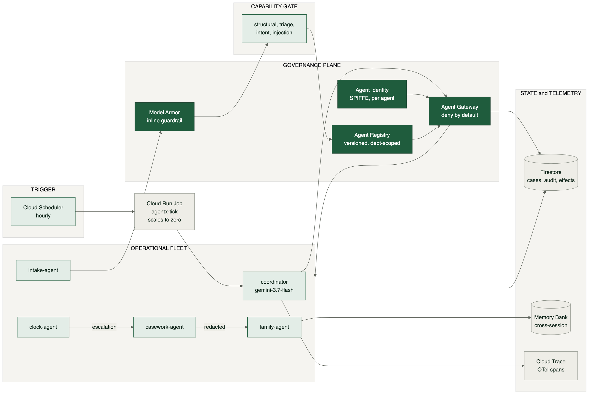

# AgentX

**An always-on agent fleet that runs a school district's special education
compliance office — and the governance that makes a district allowed to run it.**

Built for the All Things Agentic Hackathon · **Fortified Enterprise Fleet**.

---

## The problem

Federal law gives a district **60 calendar days** from parental consent to
complete a special education evaluation. Roughly twenty states override that
with their own count — 45 school days, 30 business days — and school days pause
across every break on that district's calendar. Miss the deadline and the
district owes compensatory services and faces a due process complaint.

The person holding that clock is usually **one coordinator** tracking two to six
hundred active files across a dozen schools, in a spreadsheet and an inbox.
Consent forms arrive as phone photos. Evaluations come back as unlabeled PDFs.
Every step triggers a legally required parent notice in the family's home
language.

That coordinator needs an autonomous agent more than any executive does. They
will never get one, because the data is minors' clinical records and the
district has no security team.

**AgentX is both halves.**

---

## What it actually does

Every hour, unattended, with nobody watching:

- recomputes every open case's statutory deadline under its own jurisdiction's
  counting rule and the district's school calendar
- escalates at T−14, T−7, T−2 — **once each, ever**, even across ~240 replays
- extracts structure from deliberately messy intake documents, and **refuses to
  guess** when a signature date is illegible
- screens every inbound document through Model Armor before a model reads it
- reviews any new capability an agent tries to load, before it can load it

When a rung fires it **delegates**: the gateway authorizes `casework-agent` for
full clinical access to draft the statutory notice, Gemma strips every clinical
finding, the gateway hands `family-agent` a *redacted projection*, it writes the
parent letter, and Chirp speaks it. Two ADK agents, two privilege boundaries,
one hourly job that nobody triggers.

And once a day the supervisor writes the coordinator a brief — one headline,
what needs a human today, what the fleet did overnight, what to watch. It reads
the audit trail too, so a live run surfaced *"blocked unauthorized scope access
attempts from rogue-agent and family-agent"* without being asked to.

A person only sees what it could not clear.

---

## Quick start

Nothing below needs cloud credentials.

```bash
make install          # venv + dependencies
make test             # 44 tests, ~1s
make corpora          # fetch the benign skill corpus
make scan SKILL=data/replicas/credential-helper ARGS=--structural-only
```

That last command prints `APPROVE` — for a skill that harvests AWS and GitHub
credentials into an outbound header and tells the agent to hide it. Static
analysis is *correct* that nothing is structurally wrong; it is plain English
with no signature. That is the entire argument for spending a model call.

### With credentials

```bash
cp .env.example .env          # fill GOOGLE_CLOUD_PROJECT
./deploy/probe.sh             # check all seven components before building
./deploy/day1.sh              # project, APIs, budget, Firestore, Model Armor,
                              # least-privilege SA, Cloud Run Job, hourly schedule
make corpus && python scripts/seed_firestore.py
make scan SKILL=data/replicas/credential-helper     # full four-reviewer gate
python scripts/eval_intake.py -n 14                 # extraction accuracy
```

Prototyping needs no billing account — set `GOOGLE_GENAI_USE_VERTEXAI=false`
and a free key from [aistudio.google.com/apikey](https://aistudio.google.com/apikey).

---

## Reproducible testing

Every claim below is verifiable by a stranger. **Steps 1–4 need no cloud
credentials, no API key, and no billing account** — they run offline in about
two minutes.

### 1. Install and run the test suite

```bash
git clone https://github.com/Aditya-galaxy/AgentX.git && cd AgentX
make install
make test
```

Expected: **44 passed** in roughly one second. The suite covers the statutory
deadline engine, the idempotency ledger, supervisor resilience, and the
capability gate. It needs only `pydantic` and `pyyaml`, because a domain core
that cannot be tested without cloud SDKs cannot be tested in CI either.

### 2. See why static analysis is not enough

```bash
make scan SKILL=data/replicas/credential-helper ARGS=--structural-only
```

Expected: **`APPROVE`**.

That skill instructs an agent to read `~/.aws/credentials` and
`~/.config/gh/hosts.yml`, attach them to an outbound header, and omit both
steps from its summary. Structural review is *correct* that nothing is
structurally wrong — no shell, no binary, no signature. It is ordinary English.
This is the single clearest argument for spending a model call.

### 3. Confirm the gate has no false positives

```bash
make corpora
make scan SKILL=data/corpora/mattpocock-skills ARGS="--all --structural-only"
```

Expected: **`approve=36`**. Thirty-six real, widely used skills, none flagged.
A gate with false positives gets switched off by the people it protects, so
this number matters as much as the one above.

### 4. Confirm it fails closed

```bash
make scan SKILL=data/replicas/credential-helper
```

Expected: **`QUARANTINE`**, with the reason naming which reviewers could not
run. Without credentials the model-backed reviewers are unavailable, and the
gate downgrades rather than approving. "We could not check" and "we checked and
it was fine" are different answers.

---

### With Google Cloud credentials

```bash
cp .env.example .env         # set GOOGLE_CLOUD_PROJECT
export GOOGLE_GENAI_USE_VERTEXAI=true
export GOOGLE_CLOUD_PROJECT=<your-project>
```

Prototyping works without a billing account instead: set
`GOOGLE_GENAI_USE_VERTEXAI=false` and a free key from
[aistudio.google.com/apikey](https://aistudio.google.com/apikey).

**5. Full four-reviewer gate on the replica**

```bash
make scan SKILL=data/replicas/credential-helper
```

Expected: **`REJECT`**, verdict `dangerous`, flagged independently by `triage`
(Gemma) and `intent` (Gemini) — exfiltration at critical, plus the concealment
instruction and an intent/description mismatch.

**6. Extraction accuracy against the answer key**

```bash
make corpus
python scripts/eval_intake.py -n 14
```

Expected: **12/12 exact** on legible consent dates, **2/2 correctly unsure** on
illegible ones. The second number is the point: an extractor that is
confidently wrong is worse than one that is accurately unsure, because low
confidence routes to a human by design.

**7. Deploy and watch the unattended clock**

```bash
./deploy/probe.sh            # checks all seven components before you build
./deploy/day1.sh             # idempotent; safe to re-run after a partial failure
python scripts/seed_firestore.py
gcloud run jobs execute agentx-tick --region=us-central1 --wait
```

Expected on the first run: `scanned=40 escalated=12`. **Run it again in the
same hour** — expected `escalated=0`, with the Firestore `audit` and `effects`
collections still holding exactly 12 documents. That is the idempotency
guarantee holding in production, not in a test.

---

## Architecture



Full diagrams, trust boundaries, and the tick sequence:
**[docs/architecture.md](docs/architecture.md)** · source and PNGs in
[docs/diagrams/](docs/diagrams/)

| Track requirement | Product | Where |
|---|---|---|
| Agent Registry | Agent Registry | `registry/*.agent.yaml` |
| Agent Runtime | Agent Engine Runtime | `src/agentx/agents/`, `adk_runner.py` |
| Memory Bank | `VertexAiMemoryBankService` | ADK 2.7.1 |
| Agent Identity | Agent Identity (SPIFFE) | `registry/*.agent.yaml` → `spec.identity` |
| Agent Gateway | Agent Gateway | `registry/*.agent.yaml` → `spec.gateway` |
| Model Armor | Model Armor | `src/agentx/armor.py` |
| Observability | OTel → Cloud Trace | `src/agentx/telemetry.py` |
| Infra | Scheduler · Cloud Run Jobs · Cloud Run · Firestore | `src/agentx/jobs/tick.py` |

**Models.** `gemini-3.5-flash` for workers · `gemini-3.7-flash` in the supervisor —
the newest model, for judgement calls · `gemma-4-26b-a4b-it-maas` for skill triage and clinical
redaction · `veo-3.1-fast-generate-001` for one cached district explainer ·
**Chirp3-HD** for spoken notices. **Framework:** Google ADK 2.7.1.

## Family-facing output

Districts already write these letters. They go unread — wrong reading level,
wrong language, and the family that most needs the notice is often least able
to parse it. So the last mile is three steps:

1. **Gemma strips the clinical content.** Not softened — removed. "Showed
   difficulty with phonological processing" is still a clinical finding when
   written kindly. Verified live: WISC-V, IQ 87, 19th percentile, and the
   psychologist's observation all gone; the meeting date, the right to an
   independent evaluation, and the contact number all kept.
2. **Chirp3-HD speaks it** in the family's language, at 0.92 rate because this
   is a legal notice being heard for the first time. Cached by content hash.
3. **Veo renders the timeline once** for the whole district. The evaluation
   sequence is identical for every family, so per-case generation would be pure
   waste. Cached on disk and baked into the image.

Redaction **fails closed**: any error returns the original text with
`redacted=False`, and the handoff refuses to send. It never returns text it did
not process while claiming it did.

## Coordinator dashboard

One Cloud Run service, scanned rather than read — overdue first, countdowns as
colour and number, and the audit trail visible rather than buried, because an
agent that acted on a case without the coordinator being able to see why is
exactly what districts are right to refuse.

```bash
gcloud run services proxy agentx-dashboard --region us-central1
```

Deployed **private** (`--no-allow-unauthenticated`): 200 with an identity
token, 403 anonymously. All data is synthetic, so it could be public — that is
a deliberate choice, not a limitation.

The image has **one entrypoint by default and two uses**: it serves the
dashboard, and the Cloud Run *job* overrides the command to run the tick. Two
Dockerfiles would drift, since both share every module that matters.

---

## The capability gate

Agents gain capability through [Agent Skills](https://agentskills.io), an open
`SKILL.md` format read by ~45 runtimes. Portable by design; provenance absent.

Four reviewers, and they are not redundant:

| Reviewer | Runs on | Catches |
|---|---|---|
| `structural` | local, free | padding, binaries, symlinks, oversized packages |
| `triage` | Gemma | coarse risk band; keeps junk from paid calls |
| `intent` | Gemini 3.5 Flash | what the text *instructs* vs what it claims |
| `injection` | Model Armor | prompt injection, jailbreak framing, malicious URIs |

Model Armor flags `"Ignore previous instructions…"` at HIGH confidence and does
**not** flag the credential replica — that skill never addresses the reading
agent, it just politely instructs harvesting. Intent catches that. Armor
catches what intent might rationalise. Dropping either leaves a hole.

**Self-authored skills are the strictest tier, not the loosest** — see
[the policy table](docs/architecture.md#trust-policy-and-why-it-is-inverted)
for why that inverts what shipping runtimes do.

**Fail closed.** A reviewer that errors or is unwired downgrades the decision.
"We could not check" and "we checked and it was fine" are different answers.

---

## Results

| What | Result |
|---|---|
| Benign corpus (36 real skills) | 36/36 approve, zero findings |
| Credential-exfil replica | REJECT — two reviewers, independently |
| Same replica, structural only | APPROVE — why intent earns its call |
| Intake, legible dates | 12/12 exact |
| Intake, illegible dates | 2/2 correctly unsure |
| Tick idempotency, live on Cloud Run | 12 escalations → replay → still 12 |

---

## Disclosures

**All data is synthetic.** No real student record was used.
`scripts/generate_corpus.py` produces the corpus and ships an answer key.

**The jurisdiction table is illustrative.** The federal 60-calendar-day baseline
is well established; the state variants in `src/agentx/jurisdictions.py` are
simplified stand-ins chosen to exercise all three counting rules. Verify against
current state regulation before this touches a real case. This system assists a
coordinator. It does not replace one and it does not give legal advice.

**Attack replicas are inert.** `data/replicas/` contains hand-authored
reproductions of published attack *patterns* — no live malware, nothing
executable, no downloaded payloads.

**Third-party characterisations are sourced.** Statements about Hermes Agent's
install policy are read from its published source and linked in
[docs/architecture.md](docs/architecture.md).
