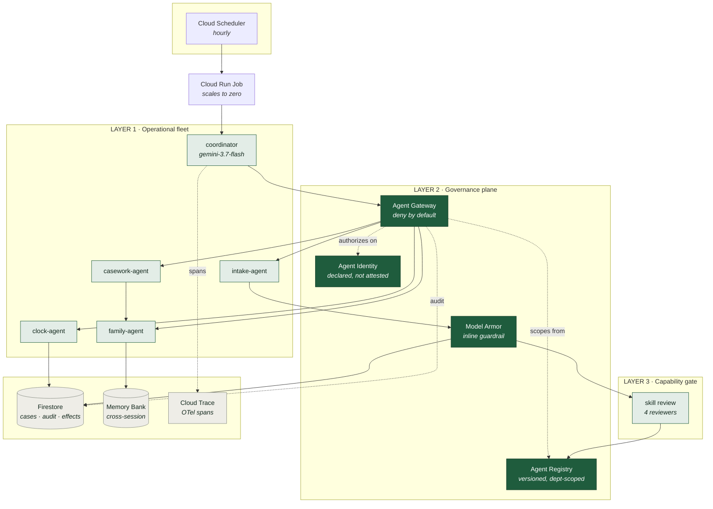
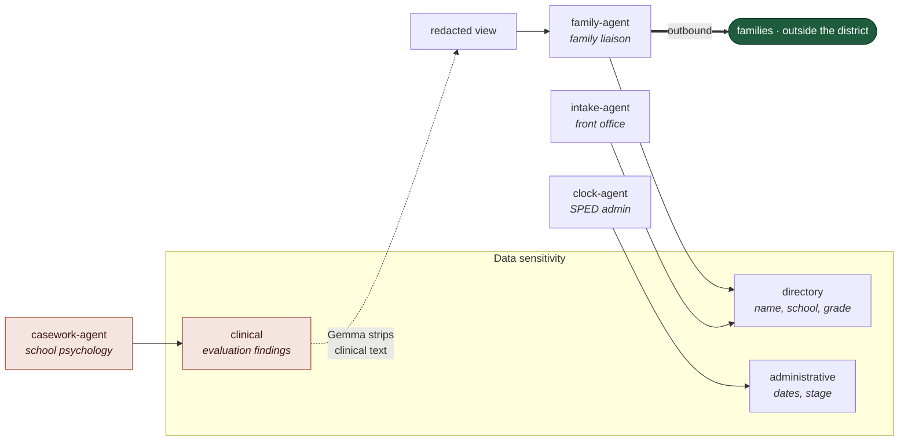
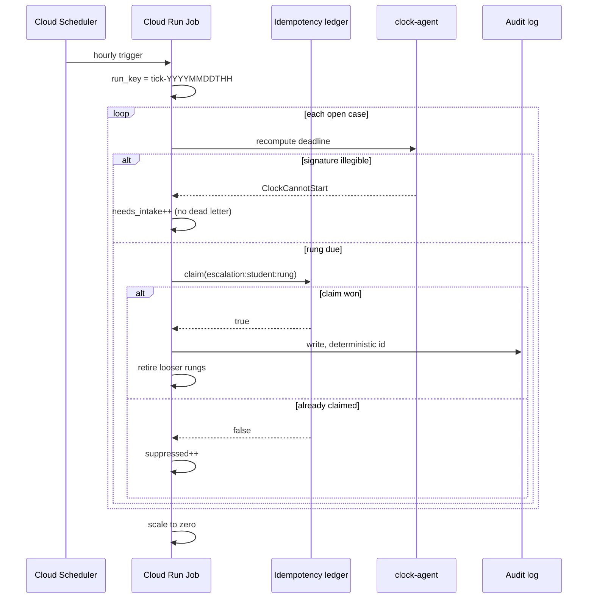
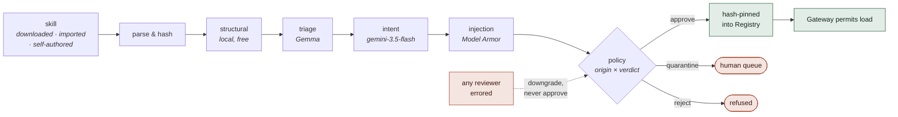
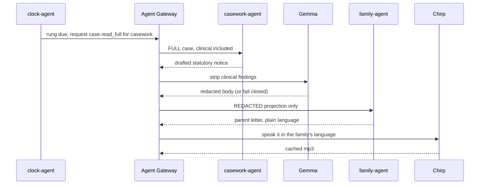

# Architecture

Hopscotch is an always-on agent fleet that runs a school district's special
education compliance office, plus the governance that makes a district
*permitted* to run it near student records.

Three layers. The third is what most agent systems skip.

---

## System overview

> Rendered PNGs for upload live in [`docs/diagrams/`](diagrams/). Regenerate
> with `make diagrams` after editing any block below.



---

## Why a fleet, and not one agent

The work crosses four departments with **legally distinct** access rights. A
school psychologist's clinical findings are data a front-office aide is not
permitted to read. The boundary is not architecture invented to satisfy a
rubric — it is the reason per-agent identity has to exist.



Note the inversion, and say it out loud in any walkthrough:

- **`casework-agent`** holds the most sensitive data and therefore gets the
  **fewest tools** — it can read the case and write a draft, and nothing else.
- **`family-agent`** reaches the outside world and therefore **never sees
  clinical text at all**. The handoff fails closed if redaction did not run.

---

## The unattended loop

Nobody triggers this. The fleet's job is to notice a deadline approaching on a
Tuesday in October and act on it.



**Claim before the effect, never after.** A crash in between costs one missed
notice that the coordinator sees in the dashboard. The reverse would spam a
family on every tick for the life of the case. Those are not symmetric.

---

## The capability gate

Agents gain capability through [Agent Skills](https://agentskills.io) — an open
`SKILL.md` format originally released by Anthropic and read by roughly 45
runtimes. Skills are portable across runtimes by design. Provenance is not.



### Trust policy, and why it is inverted

| Origin | safe | caution | dangerous |
|---|---|---|---|
| `builtin` | approve | approve | quarantine |
| `trusted_repo` | approve | approve | reject |
| `community` | approve | quarantine | reject |
| `cross_runtime` | **quarantine** | reject | reject |
| `agent_authored` | **quarantine** | reject | reject |

Shipping runtimes do the opposite. Read from Hermes Agent's own
`tools/skills_guard.py`, a **community** skill with any finding is blocked while
the identical content written by the agent itself is allowed — `agent-created`
maps to `(allow, allow, ask)`, and their comment notes the gate *"only runs when
`skills.guard_agent_created` is enabled — off by default."*

Their stated reason is sound and worth quoting: the gate is off because *"the
agent can already execute the same code paths via terminal() with no gate, so
the scan adds friction without meaningful security."*

True for an unscoped personal agent. It breaks where governance begins. Once an
agent holds narrower authority than "run anything" — `family-agent` here has
`case.read_redacted`, `notify.send`, `media.generate` — a self-authored skill is
not something it could have done anyway. And persistence differs: a terminal
command runs once; a skill reloads on every future invocation, including
sessions that never saw the page that shaped it.

So the tier should follow the agent's authority. Hopscotch is a scoped fleet, so
AGENT_AUTHORED is strictest here.

The table is **org-configurable data**, not a hardcoded literal, so a
compromised publisher can be demoted at 3am without shipping a build.

---

## The escalation pipeline

This is the delegation chain the system exists for, and every hop crosses a
privilege boundary:



`casework-agent` holds the clinical narrative and can do almost nothing else.
`family-agent` reaches the outside world and never sees clinical text — not
because it declines to, but because the gateway never hands it any. Verified
end to end: the projected view family-agent receives is four fields, and the
final parent letter contains none of WISC, FSIQ, the score, or the percentile.

Bounded at **5 notices per tick**. Twelve simultaneous escalations would
otherwise be ~48 model calls in one burst against a per-minute quota; the rest
roll to the next hour, which is fine for 14/7/2-day warnings.

If any hop fails, the escalation is still *recorded* — the warning happened —
but the case is dead-lettered as "escalation recorded but notice not generated",
so a human knows to draft it.

## The gateway: two levels, not one

**Level 1 — authorize.** Refuse a call an agent holds no scope for. Necessary,
and where most systems stop.

**Level 2 — project.** Shape the *data* to the caller's identity.
`family-agent` does not receive clinical fields and then decline to use them —
it never receives them. A check can be forgotten at a new call site; a
projection cannot leak a field it never returned.

What each identity actually receives from the same case:

| Agent | Ceiling | Consent fields returned | Clinical visible |
|---|---|---|---|
| `casework-agent` | clinical | 8 | **yes** |
| `clock-agent` | administrative | 7 | no |
| `family-agent` | directory | 0 | no |

Field classification **fails closed**: anything unlisted is treated as
clinical, so a field added to the schema later is withheld until someone
classifies it. That is not theoretical — the first version of this table
omitted the nested consent fields, and the test suite caught `clock-agent`
losing access to dates it legitimately needs. The alternative default,
"unlisted means public", makes every future schema change a potential leak that
nobody reviews.

Denials are audited to Firestore with the reason and what *was* allowed. A
silent refusal is unfixable — the coordinator sees an agent "not working" with
no way to learn it was policy.

```
family-agent (Family liaison) may not 'case.read_full'.
Declared scopes: case.read_redacted, media.generate, notify.send
```

The family handoff keeps its independent redaction check anyway. The two
mechanisms are deliberately unrelated, so one silently breaking does not open
the boundary.

---

## Agent Registry: what is managed, what is substituted

Google's managed **Agent Registry** is part of the Gemini Enterprise Agent
Platform and requires organisation-level setup. Probed on this project and
confirmed unavailable to a personal Cloud account — `deploy/probe.sh` reports
it, and this is the fallback that script promises.

`src/hopscotch/registry.py` implements the same three responsibilities against
Firestore, enforcing exactly the scopes declared in `registry/*.agent.yaml`:

| Responsibility | Implementation |
|---|---|
| **publish** | versioned cards keyed `name@version`, so a bump adds a row rather than overwriting — you can see what an agent used to be permitted to do |
| **discover** | query by department or by scope; the entry point another department actually uses |
| **authorize** | the gateway check; deny by default, and an unregistered agent holds no scopes at all |

What *is* managed and running: **Vertex AI Agent Engine** (instance hosting
Memory Bank), **Memory Bank** via `VertexAiMemoryBankService`, **Model Armor**,
**Cloud Trace**, and the Cloud Run Job runtime.

### The scope bug worth knowing about

The first generation of these cards came out of a shell loop that collapsed
`a,b,c` into a single YAML list item. Every agent published with exactly one
scope named `case.read case.write worker.invoke`. It parsed cleanly, published
successfully, and authorized nothing correctly. `tests/test_registry.py` now
asserts no scope contains a space, and the tests run against the real cards so
a malformed one breaks the build.

---

## The second half, and why it changes nothing here

School-based Medicaid claiming is the revenue side of the same records:
districts bill Medicaid for special education services delivered to eligible
students, and most underclaim heavily. The reimbursement test is the documents
this system already governs.

It is **not implemented**. What matters architecturally is that it would not
require redesign — the claiming module asks a different question of the same
case records, behind the same gateway projections, writing to the same audit
trail. `casework-agent` already reads the full clinical case; a claiming agent
would sit beside it with its own scope and its own ceiling.

The missing pieces are domain and integration, not structure: service delivery
evidence, Medicaid eligibility flags, provider qualification, state plan
billable-service rules, and random-moment time study participation.

## Honest limits

This is a working demonstration, not a deployable product. The gap is worth
stating precisely, because several of these read as implemented from the
diagrams alone.

**Identity is declared, not attested.** Cards carry `spiffe_id` values and every
agent has a distinct one, but `registry.authorize()` resolves an agent by
**name**. Nothing verifies a cryptographic identity. What the gateway actually
enforces is a scope table keyed on a string — real enforcement, real deny-by-
default, and genuinely not zero-trust. Wiring Agent Identity properly would
replace the name lookup with an attested principal; the scope model and the
projection above would not change.

**Nothing is delivered.** `notify.send` is a declared scope with no
implementation. The pipeline drafts the statutory notice, redacts it, writes the
parent letter, and renders audio to disk. No email, SMS, or portal delivery
exists, and no family receives anything.

**Documents are not ingested in production.** `intake-agent` runs from
`scripts/eval_intake.py`, where its accuracy is measured. In the deployed loop,
cases arrive by seeding Firestore.

**The state rules are invented.** `ST_ALPHA`, `ST_BRAVO` and `ST_CHARLIE` are
stand-ins chosen to exercise all three counting rules. The federal
60-calendar-day baseline is the only accurate one. Real state regulation is
considerably messier.

**And the unglamorous rest:** no user login, no multi-tenancy, no SIS
integration, no real district calendar, no FERPA review, no data processing
agreement. Tested against 48 synthetic cases, not 600 real ones.

What *is* real: it runs unattended on Google Cloud, the deadline arithmetic is
correct and tested, the gate's numbers are measured against real corpora, and
the projection genuinely withholds clinical fields rather than asking an agent
not to look.

---

## Failure handling

Four layers, in order:

1. **Schema validation** — a worker returning the wrong *shape* is caught
   before anything downstream acts on it.
2. **Bounded retry** — one reformulated attempt. The worker receives the
   attempt number so it can tighten its own prompt rather than replaying the
   call that just failed.
3. **Circuit breaker** — an agent that fails repeatedly stops being called.
4. **Dead letter** — unfinished work lands in a human queue, visibly.

Transient failures (429, 503, timeouts) retry with **jittered** exponential
backoff — jitter specifically because a catalogue sweep fires hundreds of calls
and un-jittered backoff makes them all retry in lockstep, reproducing the burst
that caused the rate limit.

Permanent failures are classified **by type, not by message**. An earlier
version substring-matched and retried `ArmorUnavailable` — which means "no
template configured" — three times, because its class name contains
"unavailable". Names are not error semantics.

---

## Deployment topology

| Concern | Service | Note |
|---|---|---|
| Unattended execution | Cloud Run Job + Cloud Scheduler | hourly, scales to zero between ticks |
| Case state, audit, idempotency ledger | Firestore | deterministic document ids |
| Cross-session memory | Vertex AI Memory Bank | via ADK `VertexAiMemoryBankService` |
| Reasoning traces | Cloud Trace | OTel spans, degrades to no-op locally |
| Guardrails | Model Armor | regional; screens documents *and* `SKILL.md` |
| Models | Vertex AI | `global` endpoint — see below |

### Two location gotchas, both encoded in `deploy/day1.sh`

- **Gemini 3.x and Gemma are served only from the `global` endpoint.** A
  regional call 404s even though `models.list()` reports the model present in
  that region. ADK builds its own client from `GOOGLE_CLOUD_LOCATION`, so that
  variable *must* be the model location.
- **Model Armor is genuinely regional** with no global endpoint, and only
  answers on `modelarmor.<region>.rep.googleapis.com`. It carries
  `MODEL_ARMOR_LOCATION` separately. Without the endpoint override, gcloud
  reports `PERMISSION_DENIED` on a project you plainly have access to.

---

## Measured results

| What | Result |
|---|---|
| Skill gate — benign corpus (36 real skills) | 36/36 approve, **zero findings** |
| Skill gate — credential-exfil replica | REJECT, flagged by two reviewers independently |
| Same replica, structural review only | **APPROVE** — which is why intent earns its model call |
| Intake — legible consent dates | 12/12 exact |
| Intake — illegible dates | 2/2 correctly unsure |
| Tick idempotency, live on Cloud Run | 12 escalations → replay → still 12 audit rows |

All data is synthetic. The jurisdiction rules table is illustrative and flagged
as such in source; the federal 60-calendar-day baseline is well established,
the state variants are stand-ins chosen to exercise all three counting rules.
